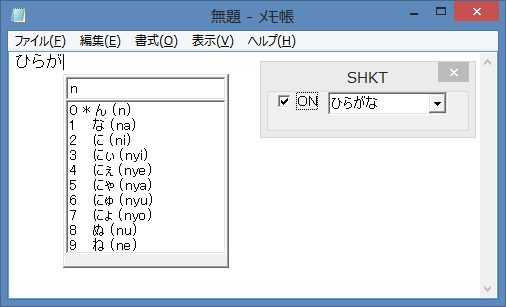
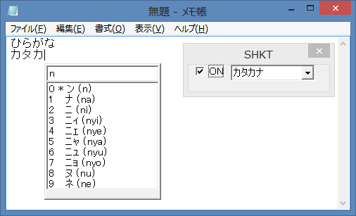
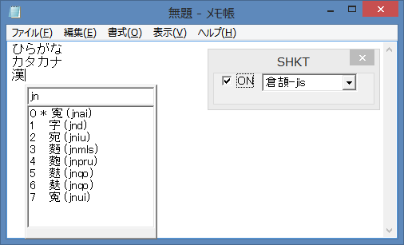
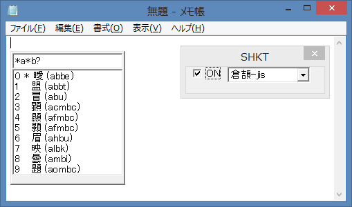

# SHKT - Simple Hiragana Katakana Table

Input Hiragana, Katakana and Kanji for MS Windows.

<a href="hiragana.png">ひらがな</a>
<a href="katakana.png">カタカナ </a>
<a href="kanji.png">漢字 </a>
<a href="wildcard.png">ワイルドカード </a>

## Build Environment

gcc-mingw-w64

## Build

make

## How to use

run shkt.exe

## Default key binding

- Control-Space: On/Off
- Space: Send String
- Alt-1: hiragana
- Alt-2: katakana
- Alt-3: hankana
- Alt-4: zenei
- Alt-5: kanji

## Configuration

edit shkt.cfg

## Table file format

`<input string><space><output string>`
